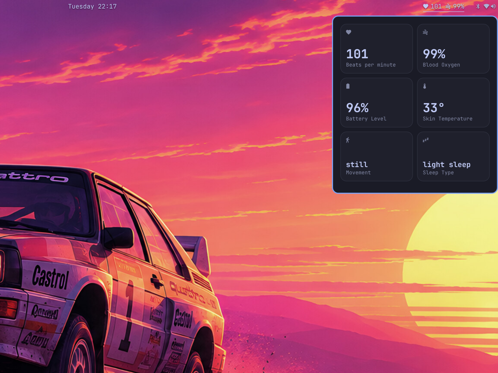
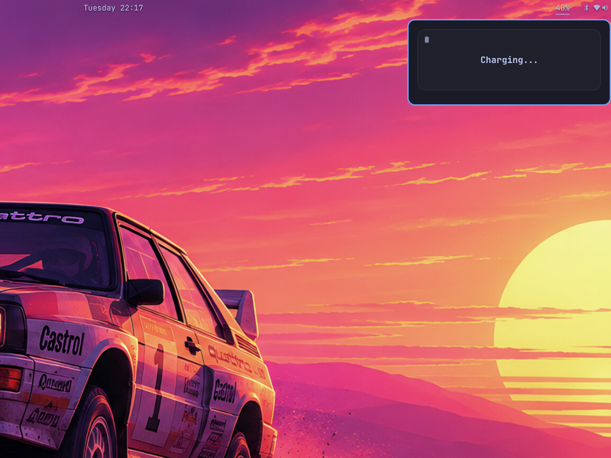

<div align="center">

# Omalet

**Owlet Smart Sock 3 vitals on the Omarchy bar.**

Heart rate and oxygen on the bar. A bento of vitals in the popup.
An optional camera still above the tiles. Desktop notifications when
Owlet alert flags rise.


<br><br>


</div>

Not affiliated with Owlet Baby Care. Uses the unofficial
[pyowletapi](https://github.com/ryanbdclark/pyowletapi) cloud client.
This is not a substitute for the official Owlet app or its alarms.

## Install

```bash
omarchy plugin add https://github.com/ravivasavan/Omalet.git --enable --yes
```

That clones the plugin, enables the bar widget, and the first refresh
creates a local Python venv with `pyowletapi`. Right-click the bar pill
and choose **Sign in**, enter your Owlet email and password, and the
password is stored in the system keyring (`secret-tool`), not in
`shell.json`. Sign out from the same menu.

Refresh interval is `refreshSeconds` on the bar entry (default 10).
Set `cameraSnapshotUrl` to a JPEG endpoint (go2rtc frame, Home Assistant
camera proxy, or similar) to show a still above the vitals. Native Owlet
Cam stills are in progress — see [STATUS.md](STATUS.md). The still
fetches when the panel opens, then every 15 seconds while it stays open,
and again on `r` or middle-click. Detach the camera (button on the still,
or right-click the pill) to float a pinned window that keeps refreshing
while you work. Nothing is fetched while the panel is closed and the
camera is attached. `showCamera` hides the tile.

## Remove

```bash
omarchy plugin remove ravivasavan.owlet --yes
```

That removes the plugin checkout and bar entry. It does not touch Hyprland
or other Omarchy config. Optional leftover cleanup:

```bash
rm -rf ~/.local/share/omarchy/owlet
rm -f ~/.local/state/omarchy/owlet.json \
      ~/.local/state/omarchy/owlet-tokens.json \
      ~/.local/state/omarchy/owlet-auth.json \
      ~/.local/state/omarchy/owlet-alerts.json \
      ~/.local/state/omarchy/owlet-camera.jpg
secret-tool clear service owlet
```

## What you see

| | |
|---|---|
| **Bar** | Heart rate and oxygen while the sock is monitoring |
| **Vitals panel** | Beats per minute, blood oxygen, battery level, skin temperature, movement, sleep type |
| **Camera** | Optional 16:9 still above the tiles while the panel is open |
| **Charging** | The bento collapses to a single **Charging...** tile (dots animate one by one); the camera still stays |
| **Alerts** | The matching tile keeps the bento and softly pulses; a notification fires on rising flags |

Left-click the bar pill to open the vitals bento. Right-click opens a menu
for sign in, sign out, refresh, and the plugin version. Middle-click
refreshes. `r` refreshes while the panel is focused.

## Dependencies

Already on a typical Omarchy install:

- Omarchy 4 / Omarchy shell (Quickshell)
- `python` (3.11+)
- `secret-tool` (`libsecret`)
- Network access to Owlet's cloud API

First run installs `pyowletapi==2025.4.10` into
`~/.local/share/omarchy/owlet/venv`. No sudo. No writes outside the plugin
directory, that venv, `~/.local/state/omarchy/owlet*`, and the keyring
item `service=owlet`.

## Privacy

- Password lives in the system keyring
- Session tokens live in `~/.local/state/omarchy/owlet-tokens.json` (mode 0600)
- Email/region live in `~/.local/state/omarchy/owlet-auth.json` (mode 0600)
- Camera stills live in `~/.local/state/omarchy/owlet-camera.jpg` (mode 0600) and are only fetched while the panel is open
- Nothing is uploaded except to Owlet's own API, through pyowletapi, plus the optional snapshot URL you configure

## Screenshots

Tokyo Night on the Omarchy Quattro wallpaper. 16:9.

| Tray | Vitals |
| --- | --- |
|  |  |

| Charging | Alert |
| --- | --- |
|  |  |

## Development

```
manifest.json    plugin declaration (kind: bar-widget)
BarWidget.qml    bar pill
Panel.qml        popup, login, context menu, charging tile, camera still, alert flash
CameraTile.qml   16:9 snapshot hero
StatBox.qml      one vitals tile
Model.js         state parsing and labels
fetch.py         unofficial Owlet poller and camera still fetch
fetch.sh         venv bootstrap + poll
login.sh         keyring store + first poll
setup.sh         create venv, pin pyowletapi
test/run.js      node test/run.js
```

```bash
omarchy plugin validate ~/.config/omarchy/plugins/ravivasavan.owlet
node test/run.js
```

Saved edits under `~/.config/omarchy/plugins/` reload automatically.
Force a rescan with `omarchy-shell shell rescanPlugins`.

## License

MIT. Owlet is a trademark of Owlet Baby Care; this plugin is unofficial
and is not a medical device.
